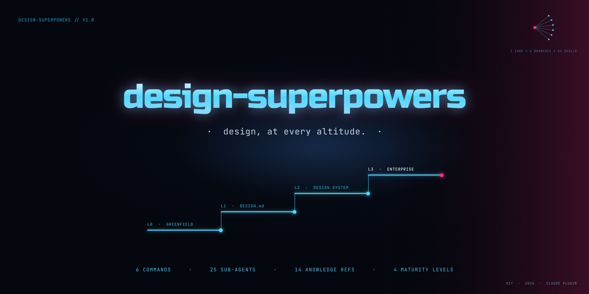

# design-superpowers

Six universal Claude Code commands that make AI work like a design team, from first moodboard to enterprise design-system governance. MIT-licensed, behavior-validated, Figma-optional.



## What it does

Each command is a router that dispatches to specialized sub-agents (27 total). Before doing anything, every command detects your **project maturity** and adapts: the same command gives a greenfield project creative freedom and an enterprise DS strict governance.

| Command | Use for |
|---------|---------|
| `/creative` | Visual direction, moodboards, palettes, typography, layout systems, imagery & art direction, design refreshes, brand architecture |
| `/ds-make` | Create or evolve DS artifacts: tokens, components, deprecations, versioning |
| `/ds-manage` | Operate the DS: publish cascades, adoption analytics, documentation, health monitoring |
| `/design` | Design product features with your existing DS: component selection, layout composition (never invents rogue components) |
| `/design-review` | Evaluate existing designs: UX heuristics, WCAG 2.1 AA, DS compliance, visual craft, motion. Severity-graded findings with effort estimates |
| `/map-design` | Extract a design language from any artifact into a living `DESIGN.md` |

## What to expect: commands × maturity

Maturity is detected automatically: **L0** nothing exists · **L1** `DESIGN.md` present · **L2** `.ds-context.md` with DS libraries · **L3** `.ds-context.md` with `ds.maturity: enterprise`. Every command announces the detected level before acting.

| | **L0 Greenfield** | **L1 Design language** | **L2 Design system** | **L3 Enterprise DS** |
|---|---|---|---|---|
| `/creative` | Full creative freedom; output feeds `/map-design` | Refines within DESIGN.md; coherent extensions only | Net-new proposals that respect existing tokens | Exploration + rationale only; token work routes to `/ds-make` |
| `/ds-make` | Scaffolds tokens/components from scratch | Extends the language toward a DS | Extends the DS via `.ds-context.md` | Delegates to **ds-producer** (intake → build → QA → publish workflows) |
| `/ds-manage` | Not available (nothing to manage); says so and points to `/ds-make` | Limited (governance undefined) | Full operations with governance rules | Full operations + lint gates + publish cascade |
| `/design` | Won't block: offers "/creative first" *or* a best-practice provisional design with every value flagged | Composes from DESIGN.md primitives | Full DS-aware composition; gaps routed, never hallucinated | Delegates to **ds-consumer** (DS-compliant feature workflows) |
| `/design-review` | UX + a11y + visual + motion lenses | + DESIGN.md conformance | All 5 lenses incl. DS compliance | + automated lint integration |
| `/map-design` | Full extraction → generates DESIGN.md | Refreshes DESIGN.md from current state | Refresh + DS snapshot | Limited (the enterprise DS is already the source of truth) |

Read by row to see what a command does as your project matures; read by column to see what your level unlocks. Nothing hard-blocks: lower-maturity paths degrade gracefully with the trade-offs named.

## What makes it different

- **Style by evidence, not vibes.** A curated context-correlation dataset maps industries/audiences to style families, typography direction, and palettes, with evidence-confidence notes and cultural caveats. A heritage pasta brand and an esports fan page get *different* candidate sets, traceably.
- **29 named style recipes, each with its "when NOT to use it."** Swiss, glassmorphism, neubrutalism, Frutiger Aero, bento, claymorphism, Y2K, editorial maximalism. Concrete specs (shadows, radii, borders, type) plus the caveat that keeps neubrutalism away from your bank.
- **Typography that resolves to fonts you actually have.** 14 type classifications, each with ranked candidates: macOS-bundled, Google Fonts (with licenses), commercial benchmarks. The suite **scans your installed fonts** (and your Figma's available fonts) and marks every recommendation `[installed]` / `[figma]` / `[needs-install]`. `/design-review` flags any DESIGN.md font your environment can't render.
- **Brand strategy in two layers.** Universal principles (distinctive assets, mental availability, promise-vs-product-truth) always outrank the named typologies beneath them (archetypes, brand-architecture types, practice philosophies).
- **Art direction is a first-class domain.** Imagery meaning (Form + Content + Context), lighting recipes, sequencing logic, 60-word image briefs usable directly as image-model prompts, and an AI image-generation capability ladder that never silently leaves gray boxes.
- **Behavior-validated, with receipts.** 300+ scenario evals across maturity levels live in the repo (latest cycle: 66/66 plus 5/5 live-Figma). See [`docs/superpowers/test-run-2026-07-13-results.md`](docs/superpowers/test-run-2026-07-13-results.md) and the [capability benchmark](docs/superpowers/benchmark-2026-07.md) against popular AI-design skills.

## Getting started

1. Install (the repo is both plugin and marketplace):

   ```
   /plugin marketplace add github:LSDimi/design-superpowers
   /plugin install design-superpowers@design-superpowers
   ```
2. Run any command in a project directory. It detects your maturity level and asks 2–3 clarifying questions before non-trivial work.
3. Greenfield? Start with `/creative` → `/map-design` and you'll have a `DESIGN.md` every later command respects.
4. Existing DS? Create `.ds-context.md` at the project root (field reference: [`skills/shared/ds-context-schema.md`](skills/shared/ds-context-schema.md)).

No Figma account, plugin, or bridge required for any of the above.

**Team entry point:** [`skills/README.md`](skills/README.md) for the routing matrix, architecture diagram, and quick reference.

## Optional: live Figma superpowers via PluginOS

Everything works from documents and descriptions. If you want commands to **read and write your actual Figma files** (live node inspection in `/design-review`, DS audits against real components, canvas writes), add [PluginOS](https://github.com/LSDimi/pluginos), a free peer Claude Code plugin:

```
/plugin marketplace add github:LSDimi/pluginos
/plugin install pluginos
```

Then install the free [Bridge plugin](https://www.figma.com/community/plugin/1626608701431483287) in Figma Desktop and open it once. `/figma-setup` verifies the chain any time. When the bridge is absent or disconnected, commands say so and degrade gracefully. They never fake a Figma read.

## Architecture

```
User → /command → Router → Sub-agent (with scoped knowledge)
                              │
                              ├── L1: Core principles (always loaded, ~1K words)
                              ├── L2: Domain references (loaded per sub-agent)
                              ├── L3: CSV lookups (grep-on-demand, never pre-loaded)
                              └── L4: Project context (DESIGN.md, .ds-context.md)
```

**6 commands → 27 sub-agents → 16 knowledge files + 6 curated CSVs** (~190 rows, every one audited for actionability and retrieval).

| CSV | Contents |
|-----|----------|
| `design-principles.csv` | Classic design frameworks + craft/anti-slop principles |
| `psychological-principles.csv` | Perception & cognition ("How People See/Think/Decide…") |
| `usability.csv` | Homepage, navigation, forms, commerce, feedback, trust patterns |
| `visual-styles.csv` | 29 style recipes with specs and when-to-avoid caveats |
| `style-contexts.csv` | Industry/audience → style, typography, palette correlations |
| `typography-styles.csv` | 14 type classifications → ranked, sourced font candidates |

## Project layout

```
skills/
├── shared/
│   ├── knowledge/              # L1 core + 15 L2 domain references
│   ├── data/                   # L3 curated CSVs (queried on demand)
│   ├── maturity-detection.md   # How commands detect L0–L3
│   ├── figma-adapter.md        # Optional Figma routing (PluginOS-first)
│   ├── font-availability.md    # Font inventories, availability marks, classification resolver
│   ├── ds-context-loader.md    # Shared context loading procedure
│   ├── ds-context-schema.md    # .ds-context.md field reference
│   └── design-principles.md    # Legacy IA principles (retained for ds-producer/consumer)
├── creative/SKILL.md           # /creative + 6 sub-agents
├── ds-make/SKILL.md            # /ds-make + 4 sub-agents (+ L3 → ds-producer)
├── ds-manage/SKILL.md          # /ds-manage + 4 sub-agents
├── design/SKILL.md             # /design + 4 sub-agents (+ L3 → ds-consumer)
├── design-review/SKILL.md      # /design-review + 5 sub-agents
├── map-design/SKILL.md         # /map-design + 4 sub-agents
├── figma-setup/SKILL.md        # /figma-setup — install/verify the optional PluginOS chain
├── ds-producer/SKILL.md        # L3 Enterprise specialization
└── ds-consumer/SKILL.md        # L3 Enterprise specialization
docs/superpowers/               # Specs, eval results, benchmark, research notes
```

## Documentation

- **Architecture spec:** [`docs/superpowers/specs/2026-04-09-universal-design-plugin-design.md`](docs/superpowers/specs/2026-04-09-universal-design-plugin-design.md)
- **Latest eval results:** [`docs/superpowers/test-run-2026-07-13-results.md`](docs/superpowers/test-run-2026-07-13-results.md)
- **Capability benchmark:** [`docs/superpowers/benchmark-2026-07.md`](docs/superpowers/benchmark-2026-07.md)
- **Sources & attributions:** [`SOURCES.md`](SOURCES.md)
- **Project conventions:** [`CLAUDE.md`](CLAUDE.md)

## Built with

- Claude Code skills (Markdown SKILL.md format)
- PluginOS (optional peer plugin for the Figma integration layer)
- Curated knowledge grounded in classic design frameworks, published usability heuristics, WCAG 2.1 AA, type-classification standards, and verified 2025–26 style research (full attributions: [`SOURCES.md`](SOURCES.md))

## License

[MIT](LICENSE) © 2026 Dimitrios Arapis. The license applies to the suite's own text, structure, and data curation; referenced frameworks and trademarks remain the property of their respective owners (see [`SOURCES.md`](SOURCES.md)).
